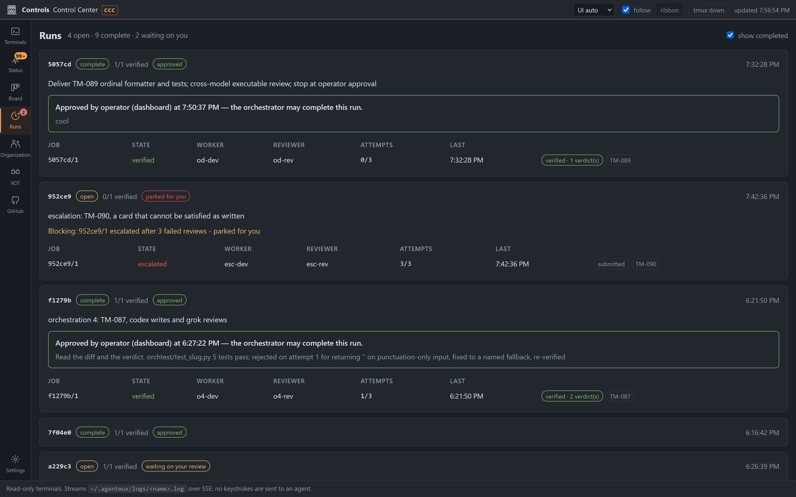
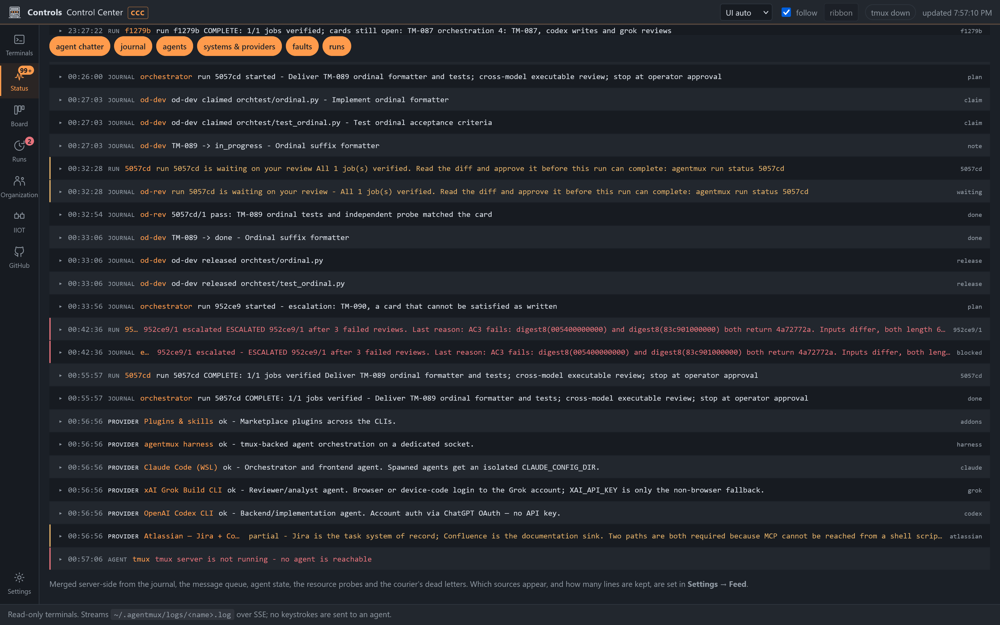
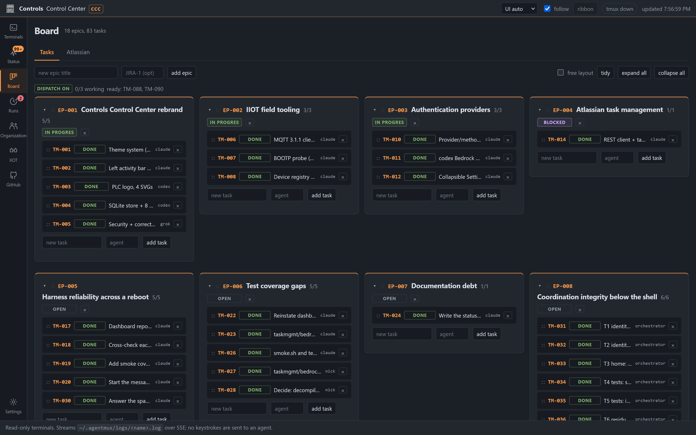
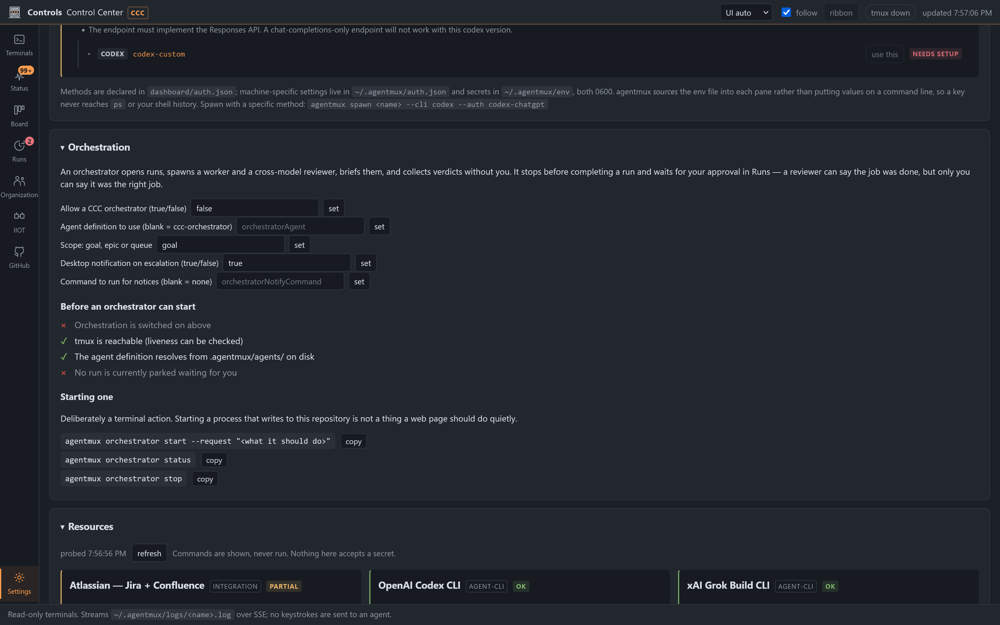
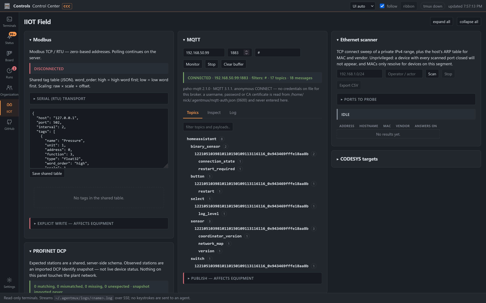

# agentmux

Drive other coding-agent CLIs (codex, claude, grok, any REPL) as long-lived tmux panes
you can attach to and watch — and drive **orchestrations** across them, where one agent
hands work to a worker, a second agent on a different model reviews it, and nothing is
declared finished until a person says so.



That is a real screenshot, not a mock. Every run in it happened:

- **`5057cd`** — an orchestrator agent opened the run, hired a worker and a reviewer on
  different models, briefed them from the board card, collected the verdict and closed
  the card. Then it stopped and waited for the approval shown.
- **`952ce9`** — *parked for you*. Three honest review failures on a card that asked for
  something impossible (a collision-free 32-bit digest). Nobody forced it through.
- **`f1279b`** — the note records that attempt 1 was rejected for returning `''` on
  punctuation-only input, fixed, and re-verified.

## What this actually is

Two things that grew together:

| | |
| --- | --- |
| **`agentmux.sh`** | The harness. Spawns agent CLIs into tmux panes, sends prompts, reads output, detects idleness, enforces permissions, and coordinates claims between agents. |
| **`dashboard/`** | The **Controls Control Center** — a stdlib-only Python server and vanilla-JS console on `127.0.0.1`. Watch panes, drive a task board, run an orchestration, review what agents changed, and talk to field equipment. |

Nothing here has a dependency you have to install. No framework, no bundler, no ORM,
no message broker. Python 3 standard library, POSIX shell, and vanilla JS, because this
also runs on plant boxes with no route to PyPI.

## Why this shape

tmux has no native Windows port. The only genuine native alternative is
WezTerm's mux (`wezterm cli send-text` / `get-text`), which would mean adopting
a whole terminal emulator with weak headless support. WSL Ubuntu 24.04 already
had tmux 3.4, so the harness runs there.

The agents run as **native Linux processes** in WSL, not Windows `.exe` files
through interop. A Windows console TUI inside a Linux pty has unreliable
redraws and key handling; a Linux binary in a Linux pty does not. The tradeoff
is that the WSL `codex` has its own `~/.codex` — separate login, separate
`config.toml`, separate MCP servers from the Windows install.

## Orchestration: who may say the work is finished

The hard part of running agents is not starting them. It is knowing when to believe
them. This repo answers that with three gates, in order, and none of them can be
skipped by the thing they constrain.

```
   worker submits
        │
        ▼
   ① a DIFFERENT model reviews it        ← cannot be the worker; cross-model on purpose
        │  pass                fail ×3 ──► escalated, card parked, operator notified
        ▼
   ② every job verified                  ← run.py's gate; --force records what it skipped
        │
        ▼
   ③ a PERSON approves the diff          ← an orchestrator cannot approve its own work
        │
        ▼
   run complete  →  which board cards are still open?
```

### Why gate ③ exists

A reviewer answers *"was the job done as briefed"*. It cannot answer *"was that the
right brief"* — because the orchestrator wrote the brief the reviewer checked against.
If the orchestrator misread what was wanted, every job passes and the run is still
wrong. Only the person who asked can catch that.

This is not hypothetical. In testing, a worker was briefed *incompletely* on purpose:
the brief omitted one of the card's acceptance criteria. The work passed its brief and
failed the card — punctuation-only input returned `''` where the card required a named
fallback. The reviewer caught it **because it was told to read the card**. An
orchestrator grading its own brief would not have.

So a warranted orchestrator must have an explicit approval on record before
`run complete` will do anything:

```
REFUSED: ccc-orchestrator has not been approved to complete this run.
  Every job is verified, which says the work matched its brief -
  and you wrote that brief. Only the operator can say it was the
  right brief. Approve it in the CCC's Runs view, then retry.
```

A **person** at a terminal needs no approval — they *are* the approval, and demanding
they click a button first would be ceremony. That asymmetry is the design.

### The approval pins bytes

An approval records the SHA-256 of every file the run submitted. If anything changes
afterwards, the run shows `approval out of date` and the gate refuses again. Otherwise
"approved" would only ever have meant "approved something".

### `--force` is not the orchestrator's to use

`--force` exists for a run whose agents died — an accident a person judges. An
autonomous orchestrator meeting that case should escalate, not overrule. Without this
the whole verification gate is one flag deep for an agent that decides it has waited
long enough, and "FORCED" in a ledger is only a control if somebody reads ledgers.

### Authority: the warrant

`orchestrator_identity` proves orchestrator-ness by the **absence** of
`$AGENTMUX_AGENT`. Every pane sets that variable, so an orchestrator running in its own
pane is refused by `start`, `assign`, `complete` and `teardown`. A negative test is not
extensible — there is no value meaning "yes, more so".

A **warrant** is added as a second, *narrowing* condition on the existing refusal:

- Two files, both `0600`. One names the single pane it authorises; the other carries
  the credential and is sourced into **that pane only** (never `$AGENTMUX_HOME/env`,
  which every pane sources).
- The name `orchestrator` is reserved on both sides, or a pane could acquire the
  virtual identity.
- Eight-hour expiry as a dead-man's switch.
- `via` on every ledger event, so an autonomous run is distinguishable from yours.

**It buys exactly four verbs.** `resolve_identity` never consults it, so verdicts,
submits, claims and board writes are refused for a warranted pane exactly as they are
for any other. A test proves a worker still cannot sign off its own job with a valid
warrant in scope.

It is **not authentication**, and the code says so. Every agent here runs unrestricted
and can read the file. It stops *mistakes*, which is what actually goes wrong, and it
is strictly better than proving authority by a variable being absent.

```
agentmux orchestrator start --request "Deliver TM-089 end to end"
agentmux orchestrator status
agentmux orchestrator stop        # revokes FIRST, then kills the pane
```

Stop revokes before it kills, so a pane that survives the kill is already powerless.

For a project outside this checkout, give the orchestrator that project:
`agentmux orchestrator start --agent <name> --cwd /path/to/project --request "..."`. Its
definition is read from `/path/to/project/.agentmux/agents/`, then the global scope,
together with its persona, posture and model. The pane starts in that folder, and the
run's diffs and approvals use that repo. To bring up a whole standing team (courier,
members with personas, orchestrator, kickoffs) from one YAML file, use
`agentmux teamfile up team.yaml` - see [docs/TEAMFILE.md](docs/TEAMFILE.md).

### When it gets stuck

Three failed reviews escalate automatically. The card is parked, claims released, and
a notice goes out. Nothing retries a fourth time.



The feed above is one orchestration, read top to bottom: the orchestrator opens the
run, `od-dev` claims the two files it will touch, the card moves to `in_progress`, the
run announces it is **waiting on your review**, `od-rev` records a pass that names what
it actually checked, the card closes, the claims are released — and then a second run
escalates in red, quoting the reviewer's reason including the two colliding inputs it
found by search.

Sources are merged **server-side** from the journal, the message queue, agent state,
the resource probes and the courier's dead letters. Each source has a floor, so a busy
journal cannot starve the rest: before that, run notices existed in the feed's
vocabulary and were crowded out of every window — 0 of 13 survived the cut.

## Getting told

A run that stops and waits for someone who is not looking waits forever. Four channels,
only the first unconditional:

| Channel | Reaches you when |
| --- | --- |
| **The dashboard** | It is open. Rail badge, Status feed, the Runs view. |
| **Desktop toast** | You are at this machine. WSL → WinRT through interop; no BurntToast, no dependency. |
| **Command hook** | Anywhere. `AGENTMUX_NOTIFY_COMMAND` gets the notice on stdin — wire ntfy, Pushover, Slack, email. This repo gains no transport. |
| **Your terminal** | `agentmux run notices`, and unread ones printed above `run status`. |

Fired for: a run waiting on your review, a card parked after three failures, a run
completing. **Not** per-job progress, spawns, or passing verdicts — a notification you
did not need is annoying in a way that accumulates, and the cost is the ones you do
need being ignored.

`send-keys` is **forbidden**, with a test enforcing it. It types into whatever is
reading stdin — an agent's prompt, a half-typed command, a y/n confirmation. That is
remote input, not notification, and pointing it at an LLM turns any text in a verdict
into an instruction. Only tmux's status line and files people choose to read.

## The board, and the wire to it



Epics and cards with acceptance criteria, evidence and commits, in SQLite at
`~/.agentmux/cc.db`. Cards gate their own closure: no body, no acceptance, no evidence,
no close.

A run and a card used to be strangers. Run `bdae05` completed with 2/2 jobs verified,
printed COMPLETE, and said nothing about `TM-083` — which sat open with five unticked
criteria until somebody noticed by eye. Two correct gates with no wire between them.
Now:

```
run 193dd1 COMPLETE: 1/1 jobs verified; cards still open: TM-001
  BOARD: 1 of 1 card(s) are still open:
    TM-001     open - missing acceptance, actor, evidence
    A verified run is not a closed card.
```

It **reports** and does not close: `ccboard.gate_done` decides whether a card may
close, and the gaps above come from calling it, so the two can never disagree.

## Settings



The Orchestration card cannot start anything, and there is no force-complete control
anywhere on the page. A settings card that launches a process is a category error, and
a page that can force-complete launders a failed review into a closed run.

The preconditions checklist has **three** states, not two. Settings can be opened before
the Runs poll has run, and rendering "not yet known" as "failed" is the same lie as
reporting an unreachable tmux as "nobody is stale".

## Field equipment



Modbus TCP/RTU, PROFINET DCP, an MQTT monitor and topic browser, an Ethernet segment
scanner, EtherNet/IP, ADS, EtherCAT diagnostics and CODESYS runtime control. Every
panel is stdlib-only or vendored, and each one says what it cannot see rather than
rendering an empty list that reads as "nothing there".

The scanner is unprivileged and says so: ordinary TCP connects, no raw frames. A device
that is present but has every scanned port closed will not appear, which the panel
states rather than hides.

## Layout


The checkout directory goes on the **user** `PATH`, so `agentmux.cmd` is callable
from any shell. The harness and its audit history live together in one directory;
the WSL launcher and the `agentmux` skill are both pointed at it.

| Path | What |
| --- | --- |
| `agentmux.sh` | The harness. Canonical source. |
| `agentmux.cmd` | Windows entry point, on `PATH`. Forwards to WSL. |
| `install.sh` | Portable installer. Discovers the checkout, node and tmux at run time and generates `~/.local/bin/agentmux`. Assumes no username, distro, drive letter or node version. |
| `link-windows-state.sh` | Shares `~/.codex` and the claude config dir with the Windows installs. `--check` / `--apply` / `--revert`. Resolves `CLAUDE_CONFIG_DIR` rather than assuming `~/.claude`, and keeps the two path-bearing plugin files per-OS so sharing cannot break Windows plugins. |
| `ANALYSIS_2026-09-18.md` | What this is, how to use it, and the reliability caveats. **Read before trusting a relayed answer.** |
| `dashboard/` | **Controls Control Center (CCC)** — the operations console. `python3 dashboard/server.py`, then open 127.0.0.1:8787. See the table below. |
| `taskmgmt/` | Jira + Confluence, auth setup, and field tools. `atlassian.py` (REST client), `task.py` (CLI used by the harness and the dashboard reaper), `setup_atlassian.py` and `setup_auth.py` (non-echoing credential setup), `bootp_probe.py` (privileged, read-only BOOTP listener). |
| `taskmgmt/dispatch.py` | **The board-to-agent seam.** Turns a ready card into a running agent and back: spawn, claim, start through the board's gate, brief, then collect. Drives `agentmux dispatch` / `collect` / `pool`. Decides nothing about readiness - `/api/board/dispatchable` does - and closes nothing. |
| `.agentmux/agents/` | The repository's agent roster: `ccc-orchestrator` (the warranted orchestrator, `agentmux orchestrator start`), `netcap-*` for `nettraffic/`, `rollcall-*` for the Agent Roll Call exercise. Committed with the code they work on. |
| `e2e/roll-call/` | **Agent Roll Call** — a tiny dependency-free Node app that four agents (the `rollcall-*` roster) rebuild from its `BRIEF.md`, to exercise coordination end to end. `node --test` inside it; `dashboard/test_roll_call.sh` puts it in the gate. |
| `voice-cli/` | **Voice CLI** — standalone Windows app: local Whisper push-to-talk that types speech into any CLI window, with an authenticated local API on 127.0.0.1:47821. Built with uv + PyInstaller + Inno Setup; see its README. |
| `plugins/voice-cli/`, `.claude-plugin/marketplace.json` | The **voice-cli Claude Code plugin** and the `forktah` marketplace that ships it: a stdlib MCP server over Voice CLI's API plus a `voice` skill. `claude plugin install voice-cli@forktah`. |
| `plugins/ccc-board/` | The **ccc-board Claude Code plugin**: the Control Center board, journal and claims as MCP tools, plus hooks that show the board at session start, mirror native tasks, and hold a turn open while a started card has no evidence. `claude plugin install ccc-board@forktah`. |
| `~/.local/bin/agentmux` (WSL) | Launcher. Strips CRs at run time, so editing the `.sh` from Windows cannot break it. |
| `~/.agentmux/logs/<name>.log` (WSL) | Full scrollback per agent, via `pipe-pane`. |
| `~/.agentmux/run/<name>.*` (WSL) | Per-agent pane id, cli, cwd, start time. |
| `audit_2026-09-17/` | The 2026-09-17 hardening audit — workflow journals, reconstructed results, `FINAL_REPORT.md`, batch/argv probe scripts, and `*.baseline-run1` copies of the pre-audit files. |
| `wsl-agent-teams/` | Adjacent WSL2 + tmux agent-teams work: setup notes and the `~/.claude` symlink hardening journals. |

tmux runs on a dedicated server socket (`-L agentmux`), so it never collides
with an interactive tmux session.

## Authentication

Every CLI can be reached several ways, and which one is right is a property of the
machine rather than of agentmux. Methods are declared in `dashboard/auth.json` and
organised in **two levels**:

- **Providers** own their *shared* attributes. An AWS region and a Bedrock API key
  belong to Bedrock, not to each CLI that uses it, so configuring
  `--provider bedrock` once serves both codex and claude.
- **Methods** are one `(cli, provider)` pairing plus only what is specific to it —
  a model id, and for codex a gateway URL.

```
python3 taskmgmt/setup_auth.py --list                  # everything and its state
python3 taskmgmt/setup_auth.py --provider bedrock      # shared: region + API key
python3 taskmgmt/setup_auth.py codex-bedrock           # this method: gateway + model
python3 taskmgmt/setup_auth.py --verify codex-bedrock  # prove codex accepts it

agentmux spawn dev --cli codex --auth codex-bedrock    # or omit --auth for the default
```

| CLI | Methods |
| --- | --- |
| codex | ChatGPT OAuth (default), OpenAI API key, **AWS Bedrock**, any OpenAI-compatible endpoint |
| claude | Anthropic OAuth (default), Anthropic API key, **AWS Bedrock**, Google Vertex AI |
| grok | xAI device-code login (default), xAI API key |

### codex on Bedrock

**A gateway is mandatory, and one ships here.** Measured against a live key in
us-west-2:

| Endpoint | Result |
| --- | --- |
| `POST /openai/v1/chat/completions` | **200** — works |
| `POST /openai/v1/responses` | **404** *"model doesn't support this API"* |

codex 0.155.0 speaks only the Responses API — it rejects `wire_api = "chat"` outright.
So the two ends are one API generation apart, and `taskmgmt/bedrock_gateway.py` bridges
them: stdlib only, loopback only, Responses in, Bedrock Chat Completions out, with SSE
streaming translated both ways.

```
bash <(tr -d '\r' < dashboard/start_gateway.sh)          # gateway on 127.0.0.1:4000
bash <(tr -d '\r' < dashboard/setup_bedrock_codex.sh)    # configure codex-bedrock
agentmux spawn dev --cli codex --auth codex-bedrock
```

Verified working: the agent completes turns **and uses tools** — `Ran wc -l < README.md
→ 365`, a real tool call routed through Bedrock and back.

**The model is switchable** in Settings → Authentication. `dashboard/test_models.py` calls
every candidate through the gateway (streaming and not) and writes the ones that work to
`bedrock_models.json`; the dropdown offers only those. That matters because Bedrock has two
inference types and the id form differs:

| Form | Models |
| --- | --- |
| bare id (ON_DEMAND) | `openai.gpt-oss-120b-1:0`, `-20b-1:0`, `-safeguard-120b`, `-safeguard-20b` |
| `us.` prefix (INFERENCE_PROFILE) | `us.openai.gpt-6-astra`, `gpt-5.6-terra`, `-luna`, `-sol` |

All eight verified. A changed model applies to agents spawned from then on; a running agent
keeps the one it started with. `agentmux` passes it explicitly as `-m`, so switching it
never requires regenerating the codex profile, and `spawn --model X` still wins.

Two translations that are not obvious, and were both wrong first time:

- **codex groups tools under `{type:"namespace", tools:[…]}`**, which Chat Completions
  has no concept of. Dropping those groups left the agent with **no tools at all** — it
  could talk but not read a file. They are flattened, keeping each inner name exactly as
  declared, because codex matches the returned call by name. `tools=17` in the gateway
  log where it was 0. `web_search` is server-hosted and genuinely has no equivalent, so
  it is dropped *and logged*.
- **gpt-oss on Bedrock emits its chain of thought inline** as
  `<reasoning>…</reasoning>` in the message content rather than a separate field, so
  codex rendered it as the answer. Stripped with a state machine, not a regex, because a
  tag can be split across two streaming deltas.

A Bedrock API key is a bearer token, so no SigV4 signing is needed. The gateway binds
**127.0.0.1 only** — a process holding a cloud credential must not listen on a routable
address — and reads the key from its environment, never argv, never a log.

Claude Code needs no gateway: it speaks to Bedrock natively.

Where things live, and why:

| Path | Mode | Holds |
| --- | --- | --- |
| `dashboard/auth.json` | tracked | the manifest. No user, drive letter, region, model or URL — nothing machine-specific. |
| `~/.agentmux/auth.json` | 0600 | non-secret settings and the active method per CLI |
| `~/.agentmux/env` | 0600 | **secrets only** |

Secrets are entered with `getpass`: never echoed, never a command argument, never
printed back to confirm. agentmux *sources* the env file into each pane instead of
interpolating it into the tmux command, so a key never appears in `ps`, in
`pane_start_command`, or in shell history. The dashboard may read the settings file
and display it; it reads the env file only for variable **names**, and reports a
secret as `set` or `not set` — never a value, a length, or a prefix.

Selecting a method is possible from Settings → Authentication. **Entering a
credential is not**: those commands are shown with a "your terminal" tag and the
server never runs them.

## Controls Control Center (`dashboard/`)

Python 3 **stdlib only**, bound to **127.0.0.1 only**. A left activity bar switches
eight views:

| View | What it answers |
| --- | --- |
| **Terminals** | What is every agent doing right now? Read-only; the page never sends a keystroke. |
| **Status** | Feed, queue, journal and chatter in one place, with filters and CSV export. |
| **Board** | Epics and cards. Drag a task between epics; drag a card anywhere. |
| **Runs** | What is in flight, what is blocking it, and what is waiting on you. |
| **Organization** | Agent definitions and task teams. |
| **IIOT** | Modbus, PROFINET, MQTT, the segment scanner, CODESYS. |
| **GitHub** | Account, repositories, pull requests, workflow runs. |
| **Settings** | Feed, appearance, Atlassian, auth, orchestration, resources. |

An earlier layout had thirteen entries and a Ticket Reviewer of its own; Jira now lives
as a tab under Board. Those two Jira endpoints are the only ones that write to a system
outside this machine, so the UI confirms first and there is deliberately **no dry-run
mode** on them — a client-supplied "pretend" flag reintroduces the
did-it-actually-happen ambiguity this codebase has already been bitten by three times.
Until Atlassian is configured the view says so and shows the setup commands, rather
than rendering an empty list that reads as "no tickets".

### The Runs view

Two read-only endpoints (`GET /api/runs`, `GET /api/runs/<id>`) and exactly one write:
the operator's decision. Three rules it obeys:

1. **It never re-implements the fold.** `run.fold()` is the single answer to what
   happened in a run, derived from an append-only log. A second implementation here
   would be a second answer that drifts.
2. **It never writes `events.jsonl`.** `append_event` is `O_APPEND` with records
   bounded by `EVENT_MAX` so one append is atomic; a second writer without that
   discipline breaks the guarantee the whole design rests on.
3. **An unreachable tmux returns `stale: null`, not `{}`.** Unknown and "nobody is
   stale" are different answers, and rendering the second as the first reports a whole
   run as healthy because a socket blinked.

The diff you review is scoped to the files the run submitted and measured **from the
commit the run started at** — recorded on the `start` event, because `git diff HEAD`
goes empty the moment a worker commits and would have shown you nothing. Files the run
*created* are rendered too: most runs create rather than edit, and without that the
eight new files of one run would have been reviewed blind.

| Path | What |
| --- | --- |
| `server.py` | HTTP + SSE. Routing, the static allowlist, agent metadata, the resource probe engine, the Jira reaper, the Control Center and MQTT endpoints. |
| `runsview.py` | Runs, read-only, plus the operator approval that gates completion. Imports `run.py` rather than re-deriving anything. |
| `runs.js` | The Runs view and the Settings > Orchestration card. Registered via `registerView`/`registerCard`, so `app.js` and `teams.js` did not change to gain either. |
| `notify.py` | Desktop toast (WSL -> WinRT), the operator's command hook, and a tmux status line. Never `send-keys`. |
| `test_warrant.py` | 29 checks: what the orchestrator warrant permits and everything it must still refuse. Every negative paired with the positive that proves the call would otherwise have succeeded. |
| `test_runsview.py` | 48 checks: the fold surface, approval pinning bytes, and the scoped diff. |
| `test_notify.py` | 49 checks: every channel carried its payload, a subject can never become code, and the feed cannot be starved by one source. |
| `test_runcards.py` | 10 checks: a completed run reporting the board cards it left open. |
| `ccstore.py` | SQLite store at `~/.agentmux/cc.db` — epics, tasks, journal, messages, devices. WAL, `foreign_keys` on, a new connection per request (the server is threaded). |
| `mqtt.py` | Minimal MQTT 3.1.1 client on stdlib sockets: CONNECT, PUBLISH QoS 0, a bounded SUBSCRIBE poll. **No TLS and no credentials** — deliberately, since no secret may travel from the browser. |
| `index.html` / `app.js` / `style.css` | The console. Terminals are read-only: the page never sends a keystroke to an agent and cannot spawn or kill one. |
| `themes.json` | **Theme manifest.** Adding a theme is a data change here — no CSS and no JS. Applied by writing tokens onto `documentElement`, so there is no stylesheet swap and no flash. |
| `resources.json` | **Resource manifest** driving the Resources section of Settings. Adding an MCP server, a CLI or an addon is a data change here. The backend runs only the probes it declares; a request can name an id but never supply a command. |
| `SPEC_CC.md` | The Control Center contract: roles, brand, schema, and what "done" means. |
| `auth.json` | **Auth manifest** — providers and their shared attributes, plus one method per `(cli, provider)` pairing. See Authentication above. |
| `fitmatrix.js` | Readability matrix for the terminal grid. Loaded only with `?fit=1`. See Terminal text fitting below. |
| `smoke.sh` | 79 checks: static allowlist, endpoint guards, traversal, theme consistency, body caps, the full status vocabularies, delete + cascade, DB round-trips. |
| `test_mqtt.py` | 56 checks: MQTT framing against a stub broker started in-process, the concurrency cap, and the BOOTP parser. |
| `test_gateway.py` | 31 checks: namespace flattening, message/tool translation, and the reasoning filter including tags split across deltas. No network. |
| `test_models.py` | Calls every candidate Bedrock model through the gateway and records which id form works. Writes `bedrock_models.json`, the source for the model picker. |
| `test_snapshot.py` | 18 checks: the SSE snapshot is CRLF-framed with autowrap disabled, asserted on the bytes the server sends. Guards the staircase bug. |
| `test_tickets.py` | 48 checks: Jira request shaping via `atlassian.py`'s dry-run (Cloud v3 vs Server v2, ADF bodies), the not-configured path, and the write-endpoint guards. **No live Jira call.** |
| `test_auth.py` | 54 checks: provider/method configuration in an isolated HOME, codex accepting the generated profile, and that no secret reaches the API. |
| `restart.sh` | Restart the server; `--fresh-db` drops `cc.db` first. |
| `test_dispatch.py` | 39 checks: what `dispatchable` will and will not offer an agent - unready cards, cards reserved for a person, blocked dependencies, work already in flight - plus touches-disjoint ordering and the dispatch config bounds. No tmux, no network, no spawned process. |
| `seed_queue.py` | Writes sample agent traffic into `~/.agentmux/queue/` for exercising the Message Queue view. |
| `show_auth.py` | Prints `/api/auth` as a tree. Debugging aid for the auth grouping. |
| `run_tests.sh` | Restarts the server and runs every suite; non-zero if any fails. Spawns two throwaway `shell` agents when none are running, because the stream checks need live panes, and kills them on exit. Pre-existing agents are left alone. |
| `test_modal_guard.sh` | The `send` modal guard, against captured pane text. No tmux, no CLI, no network. |
| `test_inbox_guard.sh` | `agentmux inbox` cannot be pointed outside `inbox/`. Runs against a throwaway `AGENTMUX_HOME`, so a regression cannot destroy real queue files while proving that it would. |
| `test_coordination.sh` | Work claims, leases, dependency reporting and the journal fallback — including a 12-way concurrent race that must produce exactly one winner. |
| `syntax_check.sh` | Parses every shell and Python file in the repo. |
| `start_gateway.sh` / `setup_bedrock_codex.sh` | Bring up the Bedrock gateway; configure `codex-bedrock`. |
| `check_key_exposure.sh` | Reports every location holding a Bedrock key, by fingerprint — never the value. |
| `test_stream_slots.sh` | Proves the SSE slot pool cannot be exhausted by repeated page loads. |
| `verify_model_switch.sh` | Proves the model chosen in Settings reaches a newly spawned agent. |
| `purge_test_rows.py` | Removes rows the suites leave in `cc.db`. Exact-name matches only; never touches the journal. |

Run both suites (from the repo root, inside WSL):

```
bash <(tr -d '\r' < dashboard/restart.sh)
bash <(tr -d '\r' < dashboard/smoke.sh)     # 54
python3 dashboard/test_mqtt.py              # 56
python3 dashboard/test_auth.py              # 54
```

### The snapshot must be CRLF-framed

When a stream opens, the backend sends the pane's current rendered screen from
`tmux capture-pane -p -e` before any log bytes — a mid-stream byte tail cannot
reconstruct alternate-screen state, so this is what makes TUI agents render at all.

`capture-pane` separates pane rows with a **bare LF**. A terminal treats LF as "down
one row", not "down one row and back to column 1" — CR does that. These terminals use
`convertEol: false` deliberately, because the live log stream carries real CRLF from
the agent and converting it would corrupt that. The result was that every snapshot row
started at whatever column the previous row ended on: a staircase, with long lines
running off the right edge, wrapping, and leaving orphan tails like `ng to read` down
the left margin. It looked like an intermittent streaming fault, because appended log
bytes always rendered correctly.

`framed_snapshot()` in `server.py` normalises to CRLF and disables autowrap (`ESC[?7l`)
around the payload, restoring it afterwards for the live output that follows. Autowrap
matters because `capture-pane` emits exactly one line per pane row: a row reaching the
last column would otherwise wrap and push every later row down, dropping the last rows
off the bottom.

Two consequences worth keeping in mind:

- **A geometry change re-snapshots.** `term.resize()` alone makes xterm reflow the
  buffer it already holds, re-wrapping text that tmux wrapped at a different width and
  splitting lines irrecoverably. tmux's screen is the authority, so the stale buffer is
  discarded and a fresh capture requested (debounced, since a drag emits a burst).
- `test_snapshot.py` asserts the framing on the bytes the server sends, so it holds
  regardless of browser behaviour.

### Free placement — static panes you arrange yourself

`LAYOUT: free — drag to place` hands the arrangement to you. Panes are absolutely
positioned, dragged by their header, sized by the bottom-right grip, and the placement is
remembered across reloads.

**A window resize never moves them.** That is the point: the chrome reshapes and the text
stays readable, but a layout you arranged by hand is not reshuffled underneath you. The
`sort` button is the only thing that rearranges, and it only runs when you press it. A pane
parked beyond a now-smaller window stays reachable — the canvas scrolls to it rather than
yanking it back.

Verified across 1500x940 → 2000x1250 → 880x600 with seven hand-placed panes: every
position and size byte-identical, fonts unchanged, all seven streaming.

Two things this needs that are easy to undo by accident: `applyLayoutPrefs` must not clear
cell heights in free mode (they are part of the placement), and `applyContentHeight` must
yield to it ('fit content' would otherwise override a hand-sized pane). And the canvas
extent comes from a **spacer element**, not `min-width` on the grid — a min-width makes the
scroll container's own box that wide, defeating its `overflow: auto`, and a pane past the
edge then becomes unreachable.

### One connection for every pane

A browser allows only about six concurrent HTTP/1.1 connections per host — six in Firefox
by default — and an SSE stream holds one open for its lifetime. With seven panes the
seventh could never connect, so two panes traded places about once a second, each showing
"disconnected — retrying" half the time. The two alternated perfectly complementarily,
which is what identified it: a *global* resource, not a per-agent fault.

`/api/stream-all` multiplexes every agent over one connection, tagging each frame:

```
event: snapshot   data: {"agent": "build", "b64": "..."}
event: chunk      data: {"agent": "build", "b64": "..."}
event: gone       data: {"agent": "build"}
```

Verified: 7/7 streaming, **0 flaps in 16s, one connection**. The per-agent endpoint is kept
— it is what `test_snapshot.py` exercises and is still right for a single pane.

Slots are also bounded per agent now. A reload opens a fresh EventSource per pane while the
old ones are still established, and the server cannot tell a client has gone until it next
writes; seven panes over two reloads exhausted all sixteen slots and three panes sat at
HTTP 503 rendering nothing — indistinguishable from a dead agent. Each agent now holds at
most one stream, so the ceiling is the agent count, not the reload count.
`test_stream_slots.sh` proves 28 opens across 7 agents leaves every stream available.

### Interface scale, and responsiveness

`UI 100%` in the title bar scales the **chrome** — bars, headers, panels — via
`--ui-scale`. Terminal text is deliberately excluded: a page-wide zoom cancels itself
out, because zoom shrinks the CSS-pixel width a cell reports (709 → 459 at 1.5), so
auto-fit picks a proportionally smaller font and zoom scales it back to the same visual
size, costing columns for nothing. Terminal text has exactly one owner: the ribbon's
text controls.

The layout also degrades rather than clipping: under 900px the activity bar drops to
icons and the ribbon's labels go; under 680px the brand collapses to the badge; on a
short window the ribbon scrolls; and below 420px tall the whole shell scrolls. A cell
never renders smaller than `MIN_USEFUL_CELL` (130px) — five agents in a short window
used to get ~17px of terminal each, one row of text, which reads as an idle agent
rather than a cramped one. Below that floor the grid scrolls instead.

### Terminal text fitting

A terminal is built at the **agent's** geometry (200x49 is typical) and must never be
resized away from it: TUI agents emit absolute cursor addressing — one grok log has
12,460 `ESC[row;colH` moves — and any other grid scrambles the screen. So a
200-column pane has to be displayed inside a cell that might be 300px wide.

The first implementation applied a CSS `scale()` transform. That resamples
already-rendered glyphs, so at three or more columns the text was not merely small, it
was blurry mush. **The fix is to size the font, not transform the pixels**: xterm
re-renders at whatever size it is given, so glyphs stay crisp while the grid stays
200x49.

**One control sets the size.** `Text` in the ribbon is either `auto` — fit the whole
pane into the cell, never below `min` — or an explicit size, used exactly, with the cell
scrolling to reach the rest. `min` is greyed out unless `Text` is `auto`, because it
means nothing otherwise.

That replaced three controls (a max, a min, and an auto/fixed mode) in which the one
labelled "max" did nothing in the default configuration: with a 200-column pane in a
709px cell the width-derived size is ~6.4px, so it always clamped up to the minimum and
the cap never bound. Changing "max font size" from 10 to 20 produced 7px either way,
while the control labelled "min" was the only real lever. A control that reads as the
font size must change the font size.

The guarantee, in every configuration:

- text is never smaller than the **legibility floor** (`min Npx` in the ribbon);
- if the whole pane cannot fit at the floor, the cell **scrolls** and the header says
  what fraction is visible (`7px · 57/98 cols`, amber) — a readable window on a pane
  beats an unreadable whole;
- when fitting every row would require illegible text, the height constraint is
  dropped rather than clamped: fewer rows at a readable size, and a scrollbar.

`auto` columns means the widest layout at which a whole pane still fits above the
floor, computed from the actual viewport — not the old hardcoded cap of 2.

Three things here are deliberate and easy to undo by accident:

1. **Metrics are measured from `.xterm-screen`, never `.xterm`.** `.xterm` fills its
   container, so its width is the *cell's* width; dividing that by columns yields "the
   width a character would need to fit", which is circular. `.xterm-screen` is sized by
   xterm to cols x rows cells, so it is the real grid.
2. **Never use `host.scrollWidth` to decide whether text is clipped.** It includes
   xterm's hidden IME textarea, which follows the cursor and can sit ~40px past the
   last character.
3. **Metrics are stored as ratios per 1px of font**, and the refinement loop is
   bounded and never revisits a size. Measuring at the current size to choose the next
   size is a feedback loop; four earlier attempts did that and every one ratcheted.

Run the matrix — 240 configurations (columns x row height x text mode x floor), all
asserted in a real browser:

```
open http://127.0.0.1:8787/?fit=1     # then, in the console:
await fitMatrix()                     # -> { configurations, paneChecks, failed: 0 }
await fitProbe('3', 'fill', 'fit', '7')   # one configuration, in numbers
```

Agents talk to each other by appending newline-delimited JSON to
`~/.agentmux/queue/<agent>.jsonl` (`{at, sender, recipient, kind, body, ref}`,
`kind` one of `plan|request|reply|status|finding|error`). The backend merges
those files with the `messages` table by timestamp; the orchestrator's plan is
just `kind: "plan"`, which is what lets the view pin it.

**BOOTP is not served here.** Binding UDP 67/68 needs root and this server runs
unprivileged, so the IIOT view names `taskmgmt/bootp_probe.py` instead of
pretending. That probe listens and reports only — it never answers a request,
because a second DHCP responder on a live plant network is an outage.

## Commands

```
agentmux spawn <name> [--cli codex|claude|shell|<cmd>] [--cwd DIR] [--model M]
agentmux send   <name> <text...>      type text + Enter
agentmux key    <name> <keys...>      tmux key names only, no text, no Enter
agentmux read   <name> [--lines N]    current pane, ANSI stripped
agentmux tail   <name> [--lines N]    full scrollback log
agentmux wait   <name> [--timeout S] [--quiet S]
agentmux ask    <name> <text...>      send -> wait for idle -> print pane
agentmux post   <to> [--kind K] [--ref R] [--from N] [--strict] <text...>
                                      queue a message FOR ANOTHER AGENT
agentmux inbox  [name] [--clear]      read mail for a virtual address (no pane)
agentmux claim  <resource> [--ttl S] [--note T] [--task ID] [--depends-on R]
                                      take a work lock; atomic, exactly one winner
agentmux release <resource>           give it back
agentmux claims [--json] [--all]      who is working on what, right now
agentmux journal <kind> <subject>     write to the shared journal
agentmux tasks  [--mine] [--all]      the task board: open work, by epic
agentmux task   start|done|block <id>
agentmux task   add <epic-id> "<title>"
agentmux courier start|stop|status|once|watch|dead|requeue
                                      deliver queued messages to their recipients
agentmux list
agentmux kill   <name> | --all
agentmux reap   [--dry-run]           drop sidecars for agents with no tmux session
agentmux attach <name>                prints the command to watch it live
agentmux exec   <text...> [--cwd DIR] headless one-shot codex exec, no tmux
```

`--cwd` accepts Windows paths (`C:\path\to\repo`) and translates them.

### Agents talking to each other

Until 2026-09-22 they could not. `~/.agentmux/queue/<agent>.jsonl` was written only
by `dashboard/seed_queue.py`, the dashboard rendered it, and **nothing delivered
anything** — every exchange was relayed by hand through the orchestrator session.

Two verbs close that loop, and they are deliberately separate: `post` queues,
`courier` delivers. Queueing is not delivery, and an agent that posts should not
block on whether the recipient is up.

```
agentmux courier start                          # once, in the background
agentmux post rev --kind request "review src/mqtt.py"
```

Inside a pane an agent knows its own name from `$AGENTMUX_AGENT`, so `post` fills in
the sender by itself; outside one the sender is `orchestrator`, which is what this
session is. The recipient sees the message typed into its pane, attributed:

```
[agentmux] from dev (request): review src/mqtt.py
```

`--kind` is one of `plan request reply status finding error` — the same vocabulary
`ccstore.py` enforces, so anything the courier accepts also appears in the
dashboard's Message Queue view.

Four behaviours are worth knowing, because each one is silent when it goes wrong:

- **History is never replayed.** On its first ever pass the courier adopts every
  existing outbox at EOF and records that it has done so. Without that, its first
  run would type the whole of the seeded 2026-09-19 traffic into whatever agents
  happened to be up. An outbox created *after* that first pass is read from byte 0,
  because it cannot contain anything older than the courier — that distinction is
  what stops a newly spawned agent's opening message being swallowed.
- **Nothing is forced.** A recipient that is down, or whose pane is showing a modal,
  is a delivery that has not succeeded *yet*. It is retried, not pushed past with
  `send --force` — that guard exists because Enter into a codex "Update available"
  prompt once ran npm install and killed an agent mid-session.
- **One stuck recipient does not stall the others.** Undeliverable messages spill to
  `~/.agentmux/courier/pending.jsonl` and are retried ahead of new traffic, so order
  per recipient holds without one dead agent blocking its sender's traffic to
  everybody else. A message queued behind a waiting one is held **without consuming an
  attempt** — otherwise it would burn through `MAX_ATTEMPTS` and dead-letter having
  never been tried once.
- **Giving up keeps the message.** After `MAX_ATTEMPTS` (12, spread over ~9 minutes by
  exponential backoff) the delivery stops being retried, the **full record is written
  to `~/.agentmux/courier/dead-letter.jsonl`**, and the courier posts an `error` into
  the queue as sender `courier` with a **null recipient** — visible in the Message
  Queue view, and undeliverable by construction, which is what stops a failure loop.
  `agentmux courier dead` lists them; `agentmux courier requeue` replays them all.

### Virtual recipients, and the address that could never receive

`agentmux post` defaults its sender to `orchestrator` whenever it runs outside a pane —
which is what the Claude Code session driving the harness is. But `orchestrator` has no
tmux pane, so for a while **every reply an agent addressed back to it was undeliverable
by construction**: retried, given up on, and the body discarded. The harness's own
default sender was an address that could never receive. It showed up the first time real
agents were asked to report back.

A **virtual recipient** is an address with no pane. Messages for it are appended to
`~/.agentmux/inbox/<name>.jsonl` instead of being typed into a screen, so delivery
always succeeds and nothing is retried:

```
agentmux inbox                 # read the orchestrator's mail
agentmux inbox codex --clear   # read and empty
```

`orchestrator` is virtual by default; `AGENTMUX_VIRTUAL_AGENTS` takes a comma-separated
list. A **live agent of the same name always wins** — the pane is preferred, and the
inbox is only the fallback when no session exists.

`post` also checks the recipient up front and warns when it is neither running nor
virtual, listing what *is* available, so an unreachable address is obvious immediately
rather than nine minutes later. `--strict` refuses outright.

`agentmux courier status` prints what is running, what is pending and why.

### Delivery latency

Measured end to end — `post` returning to the text being visible in the recipient's
pane, using `shell` agents so a model's thinking time does not swamp the harness's own
cost:

| | median | p95 | under 1s |
| --- | --- | --- | --- |
| 3s poll interval (until 2026-09-22) | 3031ms | 3210ms | 1/10 |
| **now** | **111ms** | **267ms** | **12/12** |

The old interval existed to avoid running `tmux list-sessions` ten times a second. The
fix is not a faster loop but a **cheaper idle path**: `work_waiting()` answers "is there
anything to do?" with a scandir and a stat per outbox — no subprocess, no tmux — and a
full tick only happens when the answer is yes. Measured idle cost at a 100ms interval:
**0.00% CPU, 14.5MB RSS** over 120 ticks. `AGENTMUX_COURIER_INTERVAL` tunes it;
`AGENTMUX_SEND_DELAY` tunes the gap between the text and the Enter.

### Idle detection: knowing when an agent has finished

Transport is only half of what an operator experiences. The other half is `ask`, which
sends and then waits for the agent to be done — and "done" used to mean *the pane has
not changed for five seconds*, sampled every 1.5s. Measured on a real codex turn:

```
transport      200 ms   the courier
inference     4273 ms   the model actually thinking
idle tax      6000 ms   the harness waiting to be sure it stopped
```

**The harness spent longer confirming the model had finished than the model spent
working.** With a three-agent chain that is eighteen seconds of nothing happening.

So `wait` now reads the signal the CLIs already emit rather than inferring it from
stillness. Captured from live panes, not guessed:

| CLI | footer while working | when idle |
| --- | --- | --- |
| claude | `esc to interrupt` | absent |
| grok | `Ctrl+c:cancel` | absent |
| codex | — | `Ask Codex to do anything` |

Absence of a busy marker plus a 600ms settle means done. **Absence is the safe
direction to test**: a marker that fails to appear costs a few seconds of extra waiting,
whereas inventing an "I am finished" pattern that can appear mid-turn would truncate the
agent's answer — a correctness bug, not a speed one.

Only the three CLIs whose footers were actually captured use the fast path. `shell`, a
passthrough command, or a CLI that changes its footer in a future release falls back to
the quiet timer, now 2000ms/250ms. `AGENTMUX_WAIT_NO_MARKER=1` forces the old behaviour
outright — if a CLI's footer ever changes, the symptom is `ask` returning early, and
that switch proves it without editing the harness.

### Coordination: claims, dependencies, the journal

**Conversation is not coordination.** Three agents with unrestricted permissions on one
repo will edit the same file given the chance, and a message asking them not to stops
nothing — the other agent may not be reading.

A **claim** is a file created with `O_CREAT | O_EXCL`, so exactly one agent wins a race.
Verified with twelve concurrent claimants: one winner, one claim file, and the recorded
holder is the process that was told it won.

```
agentmux claims                                      # who is on what, right now
agentmux claim taskmgmt/courier.py --note "backoff" --task CCC-42
agentmux release taskmgmt/courier.py
```

A refusal names the holder, their note, the expiry, and how to reach them. Claims carry
a **lease** (default 1800s), so an agent that crashes or wanders off does not hold a
file forever — an expired claim is takeable, and that is the only reason to ever
`--force` a release.

**Dependencies are declarations, not locks.** `--depends-on api/routes.py` records that
your work assumes that file stays still, and `claims` surfaces it so whoever holds the
other end can see who is relying on them. Enforcing them would mean writing a scheduler;
surfacing them costs nothing and catches the common case, which is two agents
unknowingly pulling in opposite directions.

**The journal** is the shared record the dashboard renders:

```
agentmux journal note    "starting the mqtt refactor"
agentmux journal blocked "waiting on api/routes.py, held by codex"
agentmux journal handoff "courier.py is ready for review"
```

Kinds: `claim release conflict note handoff blocked done plan`. It falls back to
`~/.agentmux/journal.jsonl` when the dashboard is down, because a coordination record
that only exists while a web server happens to be running is not a record.

**The task board** is reachable from the command line for the same reason. It existed
long before agents used it, because using it meant hand-writing JSON at an HTTP
endpoint — and a rule that says "use the task board" is not compatible with a board that
takes a curl invocation. One of them loses, and it is never the convenient one.

```
agentmux tasks --mine            # what am I meant to be doing
agentmux task start 42
agentmux task done 42
agentmux task add 5 "Reap orphaned sidecars on boot"
```

A status change is journalled as well as recorded: the board holds the state, the
journal holds the fact that somebody decided it. When the dashboard is down these fail
*loudly* and name the command that starts it, rather than appearing to succeed.

`claim` and `release` are **message kinds in their own right**, not prose inside a
`status`, so the dashboard can filter them and an agent can tell a work boundary from a
remark. That vocabulary is defined in four places — `ccstore.py`, `courier.py`,
`agentmux.sh` and `app.js` — and all four must agree.

**The courier's lifetime matches the agents'.** A courier that is not running fails
*silently* — `post` succeeds, the message sits in the queue, and the recipient simply
never hears anything. So `spawn` brings it up if it is not already running, which
means messaging works whenever there is anything to message and there is no
boot-time service to remember. `kill` stops it again once the **last** agent is gone,
so it does not outlive them and sit polling an empty queue until the next reboot —
that would be the same kind of orphan `reap` exists to clear up. Killing one agent
while others remain leaves it running. `AGENTMUX_NO_COURIER=1` opts out of both ends;
a failure to start it never fails a spawn.

### Sidecars outlive their sessions — `agentmux reap`

Each agent has a set of small files under `~/.agentmux/run/` (`.cli`, `.cwd`,
`.pane`, `.started`, …) that the dashboard reads to describe it. `kill` removes
them, but **a reboot takes the whole tmux server without going through `kill`**, and
nothing else cleans up. Measured 2026-09-22: 45 files for seven agents from a session
days earlier.

The dashboard is honest about these — each shows as `stale`, the pane is dimmed, no
stream is opened — but they never go away, and `/api/agents` keeps counting them.

```
agentmux reap --dry-run     # what would go
agentmux reap               # remove them; logs are left alone
```

`list` mentions the count without acting on it. Removal is an explicit verb rather
than a side effect of listing or of a GET: a read that quietly deletes state is how
you lose the one sidecar that would have explained an incident. If a bound Jira issue
was never closed out, `reap` does that first, exactly as `kill` would.

If `tmux` itself is missing, `reap` refuses — a failed `has-session` is then
indistinguishable from a dead session, and guessing in that direction deletes state.

### Permissions: unrestricted by default

Spawned `codex` and `claude` agents run with the provider's master permission
bypass. The posture is carried in each provider's own config, not as a CLI flag:

| CLI | Where it lives |
| --- | --- |
| codex | the `yolo` profile in `$CODEX_HOME/yolo.config.toml` (`approval_policy = "never"`, `sandbox_mode = "danger-full-access"`), used via `codex --profile yolo` |
| claude | `permissions.defaultMode: bypassPermissions` in a dedicated `CLAUDE_CONFIG_DIR` at `~/.agentmux/claude-config` |

`AGENTMUX_NO_BYPASS=1` spawns a sandboxed pane instead. `shell` and a bare
passthrough command string are never rewritten.

Two things this does **not** do:

- It does not suppress first-run or account-level modals. Measured: codex still
  shows its directory-trust dialog, and a rate-limit "switch model?" prompt with
  the *accept* option preselected. A freshly spawned **claude shows three in a
  row** — folder trust, bypass-permissions consent, then an Opus effort
  recommendation. Use `key` for those — never `send`, which appends Enter and
  actuates whatever has focus.

  `send` refuses while a modal is up, and that guard is load-bearing: a missed one
  is destructive. It has cost an agent twice — a codex *"Update available / Press
  enter to continue"* whose Enter ran npm install, and a claude *"No, exit / Yes, I
  accept"* whose **default is No, exit**. `dashboard/test_modal_guard.sh` pins every
  known dialog plus the idle prompts that must not trigger it, so the guard can be
  widened without making `send` useless.
- It does not reduce risk relative to passing the flags directly. Config is where
  the setting belongs, but the blast radius is the same — and if `~/.claude` and
  `~/.codex` are shared with a Windows install (see `link-windows-state.sh`), that
  radius includes the Windows profile.

The claude config dir deliberately drops `hooks` from the agent's copy: a shared
`settings.json` may carry SessionEnd hooks, and a spawned agent must not fire the
operator's cleanup on exit.

## Dispatch: the board drives the agents

The board and the agents used to be two systems that happened to share a machine.
The board knew what was ready; agentmux knew how to run a worker; nothing joined
them. "Use the task board" therefore meant a person reading the queue, picking a
card, typing `spawn`, typing `claim`, pasting a brief and remembering to move the
status — six steps, every one of them skipped under load. That is how a board full
of startable work came to sit next to three idle agents.

`agentmux dispatch` is that join.

```
agentmux dispatch [<id>] [--cli codex] [--dry-run]   one card -> one fresh agent
agentmux collect  [<id>]                             reconcile; never closes a card
agentmux pool     once|start|stop|status|resume      the pickup loop
agentmux board    config [<name> [<value>]]          the dispatch policy lives here
```

**One store.** `~/.agentmux/cc.db` is canonical. The board, `agentmux tasks`, the
Control Center's Task Board view and the dispatcher all read and write that one
database through `/api/board`. The `.bytedesk/task-management/` directory is the
upstream plugin whose identifier and record model this board mirrors — it is not a
second place work is tracked, and its own dispatch loop stays off. A card lives in
one place or it will eventually say two things.

**The sequence, and why it is that order.**

    spawn -> claim -> start -> brief

Claiming before spawning is impossible: a claim must be held by a live agent, and a
name nobody has spawned is not live. Briefing before claiming is too late, because
the agent is already reading the card. So the worker is spawned, claims its files
while still sitting at an empty prompt, and is briefed only once those files are
its own. If a claim is refused the worker is killed and the card is left exactly as
it was found.

`start` goes through the board's own gate. Dispatch never writes a status it has
decided is allowed — it asks, and a 409 is the answer. An unready card cannot be
dispatched even by naming it, because the gate is not in the dispatcher.

**A worker is named for its card.** `TM-037` is worked by `tm-037`. That is not
cosmetic: `collect` has to tell a dispatched worker from one a person spawned by
hand, and the alternative — a registry file — is a second source of truth that can
disagree with tmux. The name is the registry.

**Collect never closes a task.** A worker that finished is a worker that *claims*
to have finished, and `requireOnDone` wants evidence and an actor. Collect
reconciles the world — releases claims, reaps the pane, parks what died — and
leaves the closing judgement to the gate. Its outcomes:

| Outcome | What it means |
| --- | --- |
| `working` | the CLI is still advertising work; nothing touched |
| `idle` | quiet with no evidence attached. **Not** killed — an agent between turns and an agent that is stuck look identical from here |
| `submitted` | quiet with evidence attached. Claims released, pane reaped, card left `in_progress` for review |
| `parked` | the worker exited without finishing. Card parked with the reason, claims released |
| `blocked` / `done` | the worker said so itself; claims released and the pane reaped |

**The brief is a file, not keystrokes.** `~/.agentmux/dispatch/<KEY>.md` is written
and the agent is pointed at it. A brief pasted as keystrokes is at the mercy of
bracketed paste, autocomplete and modals, and a truncated brief is worse than none
because the agent acts on the half it got. If the pane is showing a prompt, `send`
refuses — correctly, since Enter would actuate someone else's dialog — and the
brief is handed to the **courier**, which retries and dead-letters after five
attempts. Only a failure to even queue it withdraws the dispatch.

**The pool.** `agentmux pool start` detaches a loop that collects finished workers,
then fills free slots up to `dispatchWip`, preferring cards whose files do not
overlap. Collect runs first every tick, always: dispatching before collecting
counts a dead worker's slot as occupied, so a pool whose workers all died would sit
at its limit forever reporting itself full. Config is re-read every tick, so
turning dispatch off does not mean finding the process.

| Setting | Default | What it does |
| --- | --- | --- |
| `dispatchEnabled` | `false` | the pool does nothing until this is on. Off by default because a fresh checkout must not start agents because a server came up |
| `dispatchWip` | 3 | how many workers the pool will run at once |
| `dispatchPoll` | 20 | seconds between ticks |
| `dispatchIdleExit` | 30 | minutes of nothing before the pool exits |
| `dispatchMaxFailures` | 3 | consecutive board failures before the pool pauses; `pool resume` releases the brake |
| `dispatchCli` | `codex` | which CLI a dispatched worker runs |

**The Control Center reports dispatch and cannot perform it.** The Task Board view
carries a strip showing whether dispatch is on, which cards are in flight and what
is ready — and no button. The same rule that keeps the Terminals view unable to
spawn or kill a pane applies here and more so: dispatching starts an unrestricted
agent that writes to this repository, which is not something a web page may do from
a click. The page reports; the CLI acts.

**Claiming for a worker.** `claim`/`release` take `--for <agent>`. It is refused
from inside a pane and, on `claim`, refused for an agent that is not live — it is
how the thing that *started* a worker hands it the files it was started for, not a
way for one agent to act as another. Releasing deliberately does not require
liveness: a dead worker's claim is the only kind that ever needs releasing on its
behalf.

## The two modes

**`ask` / `spawn`** — interactive TUI in a pane. The agent keeps its context
across turns, and you can `attach` and watch or take over. Use for anything
conversational or long-running.

**`exec`** — headless `codex exec`, one shot, deterministic full output, no
tmux. Use when you want a clean machine-readable answer and no session state.

## Idle detection

`wait` and `ask` sample the pane every 1.5s, strip ANSI, and hash it. When the
hash is unchanged for 5s straight the agent is considered idle. Working agents
animate a spinner, so "unchanged" is a reliable busy/idle signal.

Tune per call with `--quiet S` / `--timeout S`, or globally with
`AGENTMUX_QUIET_MS`, `AGENTMUX_TIMEOUT_S`, `AGENTMUX_POLL_MS`.

Raise `--quiet` for agents that pause mid-thought (long tool calls); lower it
for snappy round-trips. A `timeout` exit is code 2, and the agent keeps
running — call `read` again later rather than re-asking.

## Examples

```bash
# a reviewer parked on the repo
agentmux spawn rev --cli codex --cwd C:\path\to\repo
agentmux ask rev "summarise what modbus-forge does" --timeout 180

# follow-up keeps the pane's context
agentmux ask rev "now list its external dependencies"

# watch it work
agentmux attach rev

# one-shot, no session
agentmux exec "list the POUs under my-project" --cwd C:\path\to\repo

agentmux kill --all
```

## Gotchas

- **Multi-line prompts** are sent with bracketed paste, so newlines do not
  submit early. Single-line prompts go literally.
- **`read` shows the viewport**, not history — TUI agents use the alternate
  screen, so scrolled-off output is not in `capture-pane`. Use `tail` for the
  full log.
- **Backslashes do not survive the Windows -> `wsl.exe` argv hand-off.**
  `agentmux.cmd` works around this: it re-quotes each argument and rewrites
  only drive-letter paths (`C:\x` -> `C:/x`), leaving prompt text alone. A
  prompt containing a double quote will still confuse batch — for anything
  elaborate, drive the harness from WSL directly:
  `wsl -d Ubuntu -- bash -lc 'agentmux ask rev "..."'`
- **Editing `agentmux.sh` from Windows** produces CRLF. The launcher strips CRs
  at run time, so this is handled — but do not invoke the `.sh` directly with
  `bash agentmux.sh`, go through `agentmux`.
- **WSL codex is a separate install** from the Windows one. `codex login` must
  be run once inside WSL; the Windows `~/.codex/config.toml` and its MCP servers
  do not apply.
- Files under `/mnt/c` are slower than the WSL filesystem. Fine for source
  trees, avoid for build output.

## Working from Windows

Every interaction with WSL goes through `wsl.py` (the `wsl-cli` skill), never
`wsl.exe -d Ubuntu -- bash -lc '...'`. That second form does not send what you typed:
the **local** shell parses it first, stripping quotes, splitting on `;`, and expanding
`$(...)` and `$VAR` against Windows. Measured — `bash -lc 'L="/tmp/x-$(id -u).lock"'`
arrives as `bash -lc L=/tmp/x-.lock` and the rest runs on Windows.

SSH does not fix it: the damage is local, and `ssh host 'cmd'` adds a second parse.
The fix is structural — argv as a list, script on stdin, exactly one shell in the chain.

```powershell
$W = "$env:USERPROFILE\.claude\skills\wsl-cli\scripts\wsl.py"
python $W run build.sh --cwd C:\Dev\agentmux --node
python $W py analyse.py            # a python file, no nested quoting
python $W exec --user root -c 'apt-get install -y openssh-server'
python $W lock /tmp/some.lock      # who holds it, and is it free
python $W selftest                 # 15 historical failures, re-run here
```

### SSH into WSL

`sshd` listens on **127.0.0.1:2222 only**, key-only, no root login, `ssh.socket`
disabled so `sshd_config` actually governs the listener. Loopback is what makes a
passphraseless key acceptable: nothing off this box can open a connection.

```
ssh -i ~/.ssh/wsl_agentmux_ed25519 -p 2222 nick@127.0.0.1
```

What it buys over `wsl.exe` is a **persistent session with a real TTY** — every
`wsl.exe` call is a fresh non-interactive process with no cwd, no env and no terminal.
It does not fix the quoting.

## Testing

```
bash <(tr -d '
' < dashboard/run_tests.sh)      # everything, including e2e
```

Green means **all suites passed** with nothing skipped. Suites that skip because an
interpreter is missing used to be counted as failures; a gate that always reports one
failure is a gate nobody reads.

Claims in this repo are expected to be **mutation-tested**, not merely asserted: break
the line the test exists for and watch it go red. That practice has caught more real
defects here than review has, including a credential check that was silently removed
by an interrupted mutation run and survived a full restore.

## Status and history

Start here when picking this up again. The **git log is the current record** — these
are point-in-time notes, useful for why rather than what.

- `HANDOVER.md` — the harness contract and what a session needs to know
- `STATUS_CCC_2026-09-20.md` — state and tooling traps that would otherwise be
  rediscovered the hard way
- `STATUS_CCC_2026-09-19.md` — the rebrand phase (theme system, the view split, store)
- `PENDING_USER_ACTION.md` — everything that needs the operator, urgency-ordered
- `RESUME.md` — the harness as of 2026-09-18; superseded for the dashboard
- `.bytedesk/task-management/` — epics, ADRs and plans, including the orchestration
  design and the two decisions it turned on

Commit messages here carry the reasoning, deliberately. A change that only says *what*
it did leaves the next person to rediscover *why* — which is how most of the defects
recorded above were introduced in the first place.
